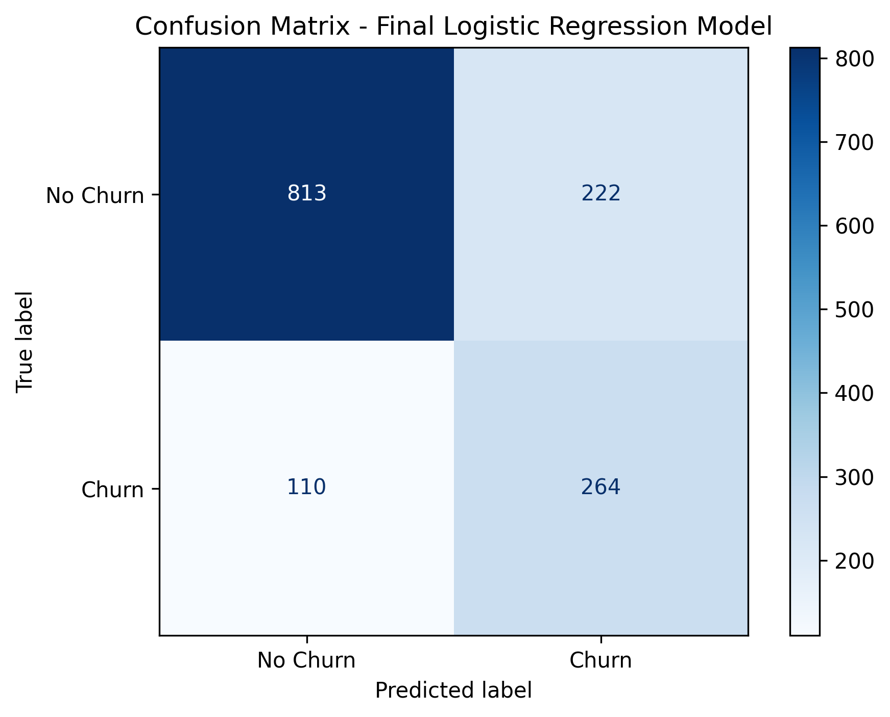
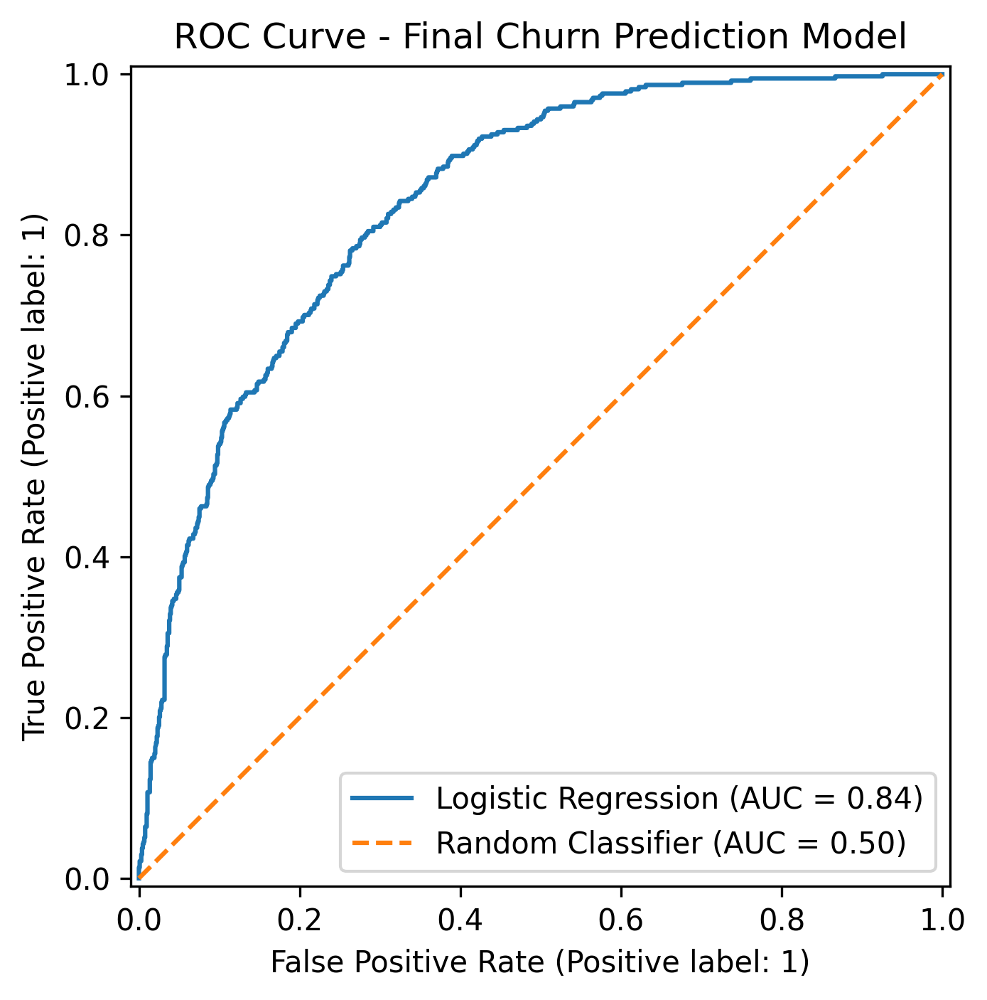
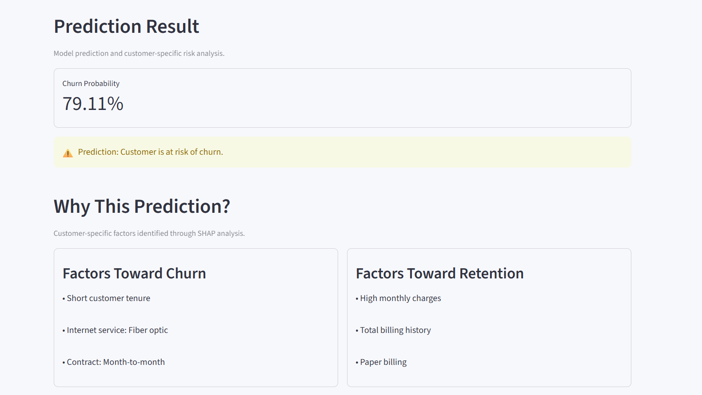

# Customer Churn Prediction System

An end-to-end machine learning application that predicts customer churn risk and provides customer-specific explanations for each prediction using SHAP.

The system combines a machine learning pipeline with a Flask REST API and an interactive Streamlit interface. The final model uses a decision threshold selected through out-of-fold predictions to balance precision and recall for churn detection.

## Key Features

- Customer churn probability prediction
- Logistic Regression classification model
- Automated preprocessing pipeline
- Cross-validation based model comparison
- Out-of-fold threshold selection
- Custom decision threshold of 0.35
- SHAP-based customer-level explanations
- Flask REST API for model inference
- Interactive Streamlit frontend
- Final evaluation on a held-out test set

## Final Model Performance

| Metric | Score |
|---|---:|
| Accuracy | 76.44% |
| Precision | 54.32% |
| Recall | 70.59% |
| F1 Score | 61.40% |
| ROC-AUC | 84.20% |
| Decision Threshold | 0.35 |

## Project Architecture

The application follows an end-to-end prediction and explanation workflow:

```text
Customer Input
      ↓
Streamlit Frontend
      ↓
Flask REST API
      ↓
Saved Preprocessing + ML Pipeline
      ↓
Churn Probability
      ↓
Decision Threshold (0.35)
      ↓
Churn / No Churn Prediction
      ↓
SHAP-based Local Explanation
      ↓
Prediction + Probability + Key Factors
      ↓
Streamlit Result Display

```

## Model Development and Selection

Three classification algorithms were evaluated using cross-validation on the training data:

| Model | Accuracy | Precision | Recall | F1 Score | ROC-AUC |
|---|---:|---:|---:|---:|---:|
| Logistic Regression | 0.8019 | 0.6521 | 0.5438 | 0.5924 | 0.8461 |
| Random Forest | 0.7865 | 0.6282 | 0.4816 | 0.5448 | 0.8196 |
| XGBoost | 0.8044 | 0.6660 | 0.5291 | 0.5894 | 0.8470 |

### Why Logistic Regression?

Logistic Regression was selected as the final model because it provided competitive predictive performance while remaining simpler and more interpretable.

Although XGBoost achieved a slightly higher ROC-AUC (`0.8470` compared with `0.8461`), the difference was marginal. Logistic Regression also achieved a slightly higher cross-validation F1 score (`0.5924` compared with `0.5894`).

Since this project focuses not only on prediction but also on customer-level explainability and actionable churn-risk insights, Logistic Regression provided a strong balance between performance, simplicity, and interpretability.

### Threshold Selection

The default classification threshold of `0.50` was not used automatically.

Out-of-fold probabilities were generated from the training data, and multiple candidate thresholds were evaluated based on the precision-recall trade-off and F1 score.

A decision threshold of 0.35 was selected for the final prediction system. On the held-out test set, this configuration achieved:

- Churn Recall: `70.59%`
- Churn Precision: `54.32%`
- F1 Score: `61.40%`
- ROC-AUC: `84.20%`

The lower threshold improves the model's ability to identify customers at risk of churn, while accepting an increase in false-positive alerts.

## Explainable AI with SHAP

The project uses SHAP (SHapley Additive exPlanations) to explain the behavior of the final Logistic Regression model.

### Global Explainability

Global SHAP analysis was used to understand which features have the strongest overall influence on model predictions across the test dataset.

The analysis identified features such as customer tenure, billing information, contract type, and internet service type among the important drivers of the model's predictions.

A SHAP beeswarm plot was also used to examine both the magnitude and direction of feature contributions.

### Local Explainability

For every customer prediction, the Flask API generates a customer-specific SHAP explanation.

The system separates the strongest feature contributions into:

- Factors pushing the model output toward churn
- Factors pushing the model output toward retention

For example:

```text
Prediction: High Churn Risk
Probability: 59.77%

Factors pushing toward churn:
- Short customer tenure
- Internet service: Fiber optic
- Contract: Month-to-month

Factors pushing toward retention:
- Total billing history
- Low monthly charges
- Single phone line
```

These explanations are generated dynamically from the customer's input and corresponding SHAP values. .

SHAP is used to explain the model's behavior and feature contributions; it does not determine the final prediction. The final classification is based on the predicted churn probability and the selected decision threshold of `0.35`.

## Technology Stack

| Layer | Technologies |
|---|---|
| Programming Language | Python |
| Data Processing | Pandas, NumPy |
| Machine Learning | Scikit-learn, XGBoost |
| Explainability | SHAP |
| Backend API | Flask |
| Frontend | Streamlit |
| Model Serialization | Joblib |
| Visualization | Matplotlib, Seaborn |
| Development Environment | Jupyter Notebook, VS Code |

## Project Structure

```text
CHURN/
│
├── app/
│   └── app.py
│
├── backend/
│   └── backend.py
│
├── datasets/
│   └── raw/
│       └── telco_churn.csv
│
├── models/
│   ├── churn_pipeline.pkl
│   ├── churn_threshold.pkl
│   ├── shap_explainer.pkl
│   └── shap_feature_names.pkl
│
├── notebooks/
│   ├── data_analysis.ipynb
│   └── model_training.ipynb
│
├── reports/
│   ├── final_confusion_matrix.png
│   ├── final_model_metrics.csv
│   ├── final_roc_curve.png
│   └── model_comparison.csv
│
├── .gitignore
├── README.md
└── requirements.txt
```
## Installation and Setup

Clone the repository and navigate to the project directory:

```bash
git clone <repository-url>
cd Churn
```

Create and activate a virtual environment:

```bash
python -m venv .venv
.venv\Scripts\activate
```

Install the required dependencies:

```bash
pip install -r requirements.txt
```

## Run the Application

Start the Flask backend:

```bash
python backend/backend.py
```

Open another terminal, activate the virtual environment, and start the Streamlit frontend:

```bash
streamlit run app/app.py
```

## API Endpoints

### Health Check

```text
GET /health
```

Checks whether the Flask API is running.

### Churn Prediction

```text
POST /predict
```

Returns the customer's churn prediction, probability, decision threshold, and SHAP-based factors pushing the model output toward churn or retention.

## Results and Visualizations

The final Logistic Regression model was evaluated on the held-out test set using the selected decision threshold of `0.35`.

### Final Performance

| Metric | Score |
|---|---:|
| Accuracy | 76.44% |
| Precision | 54.32% |
| Recall | 70.59% |
| F1 Score | 61.40% |
| ROC-AUC | 84.20% |

### Confusion Matrix

The final model correctly identified `264` out of `374` actual churn customers, achieving a churn recall of approximately `70.6%`.



### ROC Curve

The final model achieved a ROC-AUC score of `0.842`, indicating good discrimination between churn and non-churn customers.



## Application Screenshots

### Churn Risk Prediction and SHAP Explanation

The application displays the predicted churn probability along with customer-specific factors pushing the model output toward churn and retention.


```
